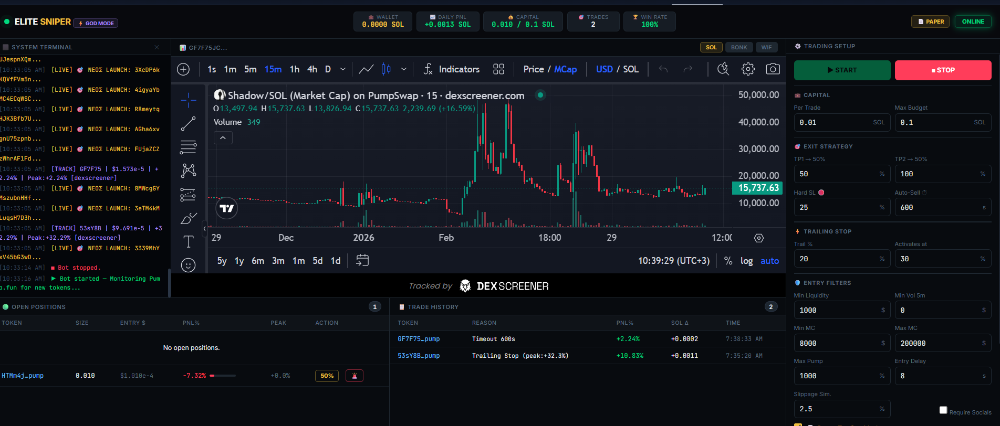

<div align="center">

# ⚡ Elite Solana Sniper Bot (God Mode)
**A high-frequency, professional-grade Solana trading bot with an advanced Web GUI.**

[](https://solana.com)
[](https://nodejs.org/)
[](https://huggingface.co/spaces/karidasd/solana-sniper-bot)

</div>

<p align="center">
  
</p>

---

## 📖 Overview
**Elite Solana Sniper Bot** is a blazing-fast, automated trading system designed specifically for the Solana blockchain. It actively monitors new token launches (primarily on **Pump.fun**) and executes high-speed sniper trades. 

👉 **[View Live Demo on Hugging Face](https://huggingface.co/spaces/karidasd/solana-sniper-bot)** 👈

What sets this bot apart is its **Professional Web UI Dashboard**, which allows you to monitor your wallet, daily PnL, active positions, and trade history in real-time, from any device.

## ✨ Features (God Mode)

- 🎛️ **Advanced Web Dashboard**: A beautiful, terminal-styled dark mode UI for real-time monitoring and control.
- 💸 **Live Paper Trading**: Test your strategies with 0 risk. The bot simulates real market prices and liquidity without spending actual SOL.
- 🎯 **Multi-Level Exit Strategy**: 
  - **TP1 & TP2 (Take Profit):** Automatically scale out (e.g., sell 50% at +50% profit, sell the rest at +100%).
  - **Trailing Stop Loss:** Lock in profits automatically as the token price climbs.
  - **Hard Stop Loss:** Protect your capital from rug pulls with strict downside limits.
- 🛡️ **Anti-Rug & Safety Checks**: Built-in verification for Mint Authority, Freeze Authority (Honeypot detection), minimum Liquidity, and Market Cap limits.
- 🔐 **Admin Secured UI**: Protect your public dashboard with a password. Visitors can watch the live demo, but only the admin can execute trades.
- 🚀 **Cloud Deployment Ready**: Includes a `Dockerfile` and automated GitHub Actions for instant, free deployment on **Hugging Face Spaces** or Render.

## 🛠️ Tech Stack
- **Backend:** Node.js, Express.js
- **Blockchain:** `@solana/web3.js`, Helius RPC Websockets, Jupiter API
- **Frontend:** Vanilla JS, CSS (Glassmorphism & Cyberpunk aesthetics), DexScreener Embeds

## 🚀 Quick Start (Local Setup)

1. **Clone the repository:**
   ```bash
   git clone https://github.com/karidasd/solana-sniper-bot.git
   cd solana-sniper-bot
   ```

2. **Install Dependencies:**
   ```bash
   npm install
   ```

3. **Configure Environment:**
   Rename `.env.example` to `.env` and fill in your details:
   ```env
   PRIVATE_KEY="YOUR_PHANTOM_PRIVATE_KEY"
   RPC_URL="https://mainnet.helius-rpc.com/?api-key=YOUR_KEY"
   WSS_URL="wss://mainnet.helius-rpc.com/?api-key=YOUR_KEY"
   ADMIN_PASSWORD="your_secure_password"
   ```

4. **Run the Bot:**
   ```bash
   npm start
   ```
   *Open your browser at `http://localhost:3001`*

## ☁️ Cloud Deployment (Hugging Face)
This project is configured to run 24/7 on Hugging Face Spaces for free.
1. Create a **Docker Space** on Hugging Face.
2. Add your GitHub repository via the Hugging Face Settings.
3. Add your `PRIVATE_KEY`, `RPC_URL`, `WSS_URL`, and `ADMIN_PASSWORD` in the **Variables and secrets** section of your Space Settings.
4. Your bot is now live and accessible from anywhere!

## ⚠️ Disclaimer
**This software is for educational purposes only.** Cryptocurrency trading is highly volatile and extremely risky.
> **The 90/90/90 Rule:** 90% of new traders lose 90% of their money in the first 90 days.

The developers are not responsible for any financial losses incurred while using this bot. Never use funds you cannot afford to lose, and never share your private keys.

---
<div align="center">
  <i>Built with speed, safety, and profitability in mind.</i>
</div>
